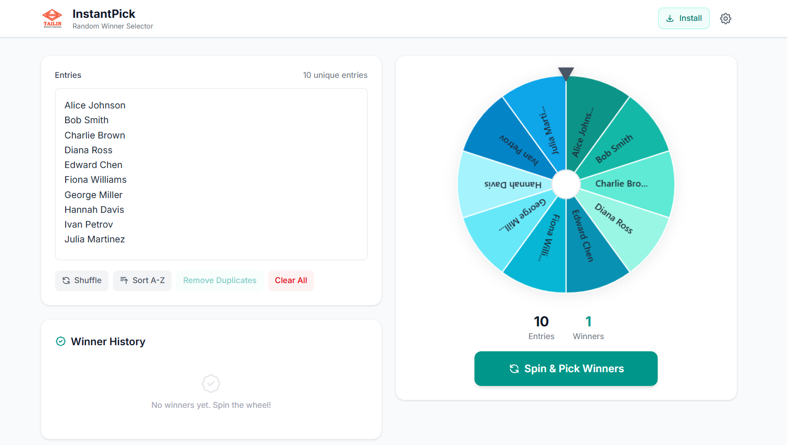
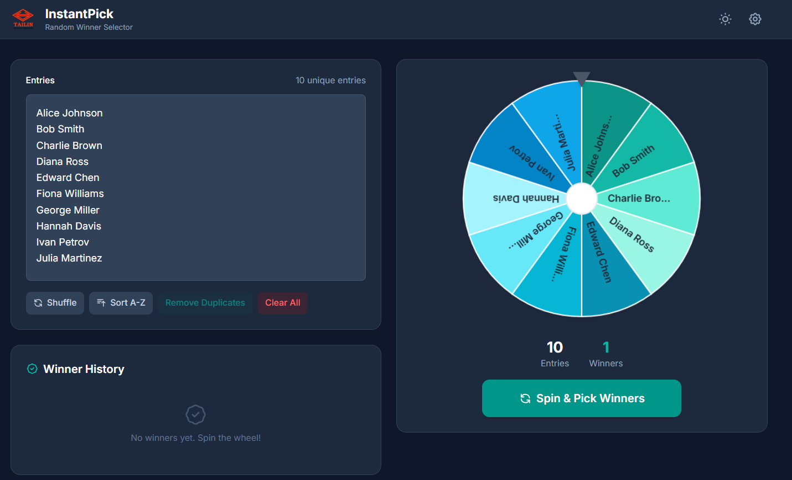
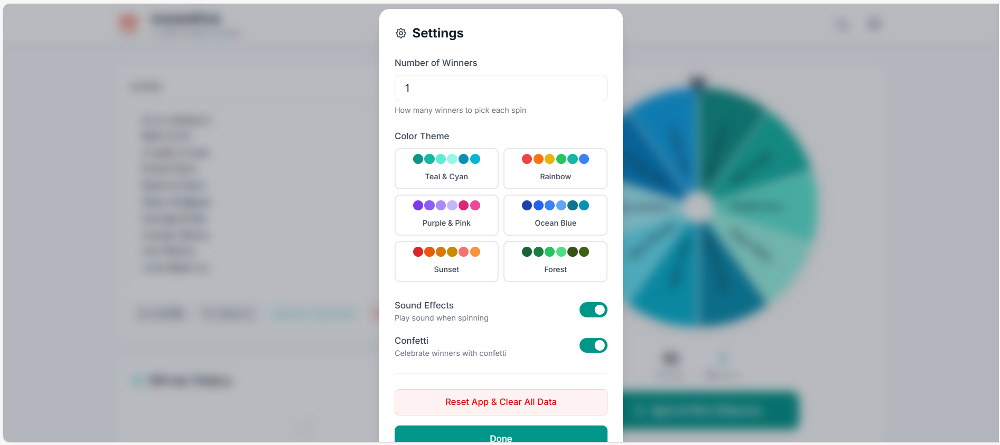
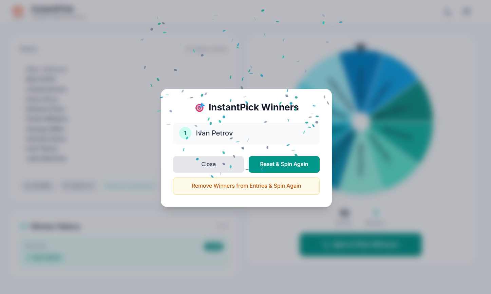

# InstantPick 

**InstantPick** is a professional, minimalist spin-the-wheel web app for instantly picking random winners at corporate events, team meetings, or TV displays. Inspired by WheelOfNames, it's designed for speed, clarity, and reliability.



##  Features

-  **Spin-the-Wheel** - Randomly select winners from a list of names with smooth animations
-  **Easy Entry** - Paste or type names, one per line
-  **Winner History** - See previous draws with timestamps
-  **Shuffle & Sort** - Shuffle entries randomly or sort A-Z
-  **Remove Duplicates** - Instantly clean up your list
-  **Multi-Round Draws** - Remove winners from entries for next round
-  **Settings Panel** - Choose number of winners, enable/disable sound & confetti
-  **Color Themes** - 6 beautiful wheel color themes (Teal, Rainbow, Purple, Ocean, Sunset, Forest)
-  **Dark Mode** - Easy on the eyes with full dark mode support
-  **Logo Support** - Add your company logo for branding
-  **Fast Spin** - Quick animation (~3s) for instant results
-  **Sound Effects** - Realistic wheel ticking and win sounds (can be disabled)
-  **Confetti Celebration** - Celebrate winners with confetti (can be disabled)
-  **Local Persistence** - Entries, settings, and history saved in your browser
-  **PWA/Offline** - Works offline and installable as an app
-  **Responsive** - Looks great on desktop, tablet, and mobile

##  Screenshots

### Light Mode


### Dark Mode


### Settings Panel


### Winner Modal


##  Demo

[Live Demo on GitHub Pages](https://seannyboyyy.github.io/instantpick/)

##  Getting Started

### Prerequisites

- Node.js 18+ installed
- npm or yarn

### Local Development

```bash
# Clone the repository
git clone https://github.com/SeannyBoyyy/instantpick.git

# Navigate to the project
cd instantpick

# Install dependencies
npm install

# Start the development server
npm run dev
```

Open [http://localhost:5173/instantpick/](http://localhost:5173/instantpick/) in your browser.

### Build for Production

```bash
npm run build
```

The output will be in the `dist/` folder, ready for static hosting.

##  Usage

1. **Add Entries** - Enter names in the left panel (one per line)
2. **Spin** - Click the **Spin** button to pick winners
3. **Settings** - Click the gear icon to adjust:
   - Number of winners per spin
   - Wheel color theme
   - Dark/Light mode
   - Sound effects on/off
   - Confetti celebration on/off
4. **Manage Entries** - Use **Shuffle**, **Sort A-Z**, **Remove Duplicates**, or **Clear All**
5. **Winner History** - View previous winners below the entry box

##  Customization

### Company Logo
Replace `public/logo.png` with your own logo for branding. The favicon and header will use this file.

### Color Themes
Choose from 6 built-in color themes in Settings:
- **Teal & Cyan** (default)
- **Rainbow**
- **Purple & Pink**
- **Ocean Blue**
- **Sunset**
- **Forest**

##  Technologies

| Technology | Purpose |
|------------|---------|
| React 18 | Frontend framework |
| Vite | Build tool & dev server |
| Tailwind CSS v4 | Styling |
| Framer Motion | Animations |
| Headless UI | Accessible UI components |
| Canvas API | Wheel rendering |
| canvas-confetti | Winner celebrations |
| LocalStorage | Data persistence |
| vite-plugin-pwa | PWA & offline support |

##  Project Structure

```
instantpick/
 public/
    logo.png           # Company logo
 src/
    components/
       Wheel.jsx      # Spinning wheel component
       EntryInput.jsx # Name entry component
       SpinButton.jsx # Spin button
       WinnersModal.jsx
       SettingsPanel.jsx
       InstallButton.jsx
    utils/
       pickWinners.js # Winner selection logic
    App.jsx            # Main app component
    main.jsx           # Entry point
    index.css          # Global styles
 screenshots/           # App screenshots for README
 index.html
 vite.config.js
 package.json
 README.md
```

##  Privacy

InstantPick stores all data locally in your browser's LocalStorage. No data is sent to any server. Your entries and settings stay private on your device.

##  License

MIT License - feel free to use this project for personal or commercial purposes.

---

Made with  for event organizers everywhere
